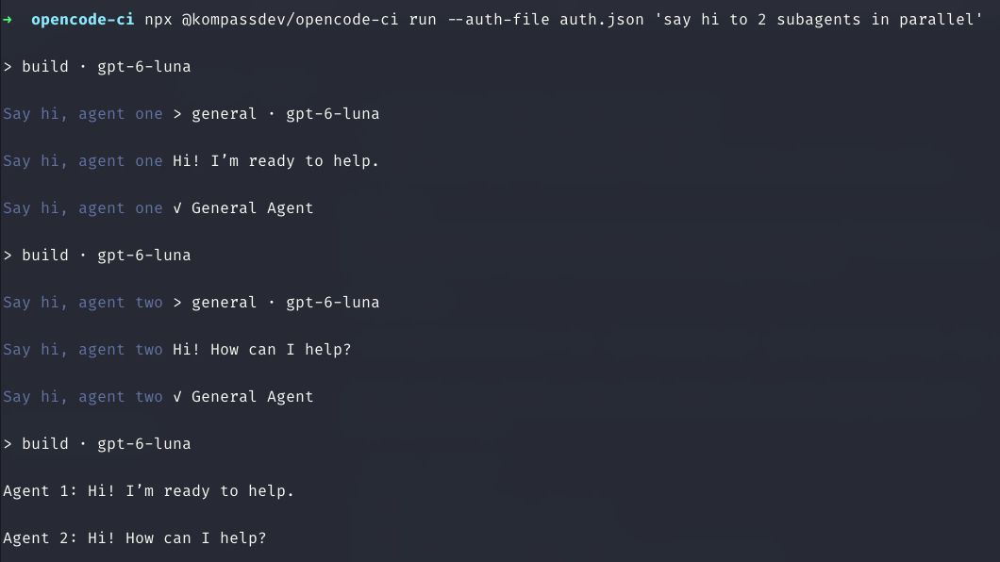

# OpenCode CI

- Subagent output: see child agents' steps and replies in the log.
- `/commands`: run a project command from the prompt.
- `@skills`: attach a project skill by mentioning it.
- OAuth (`~/opencode-ci.auth.json`): use a ChatGPT Plus/Pro (Codex) login in CI instead of an API key.

## Subagent output

```sh
npx @kompassdev/opencode-ci run 'say hi to 2 subagents in parallel'
```

`opencode run` shows a subagent call but not the child's transcript. This client prints the child's steps and replies, with a dim-colored name in terminals and GitHub Actions:



Child output streams as it arrives, even when subagents overlap. If the event stream misses a message, the client prints the saved message before that subagent's completion line.

## `/command`

Run a command defined in your OpenCode project:

```sh
npx @kompassdev/opencode-ci run '/review the changed tests'
```

## `@skill`

Mention a project skill to attach it. `bunx` works too:

```sh
bunx @kompassdev/opencode-ci run 'Use @review to inspect the changes'
```

You can also write `@skill:review`. The command and skill examples require a project definition named `review`.

## OAuth credentials

The client reads `~/opencode-ci.auth.json` when it exists and saves refreshed tokens to the same file:

```sh
npx @kompassdev/opencode-ci run --model openai/gpt-6-luna 'Review this repository'
```

See [how to export your login](#use-your-opencode-login-in-ci) and [use it in GitHub Actions](#github-actions-with-oauth). Keep credentials out of version control.

## GitHub Actions

### API key

```yaml
name: Review with OpenCode
on: workflow_dispatch

permissions:
  contents: read

jobs:
  review:
    runs-on: ubuntu-latest
    steps:
      - uses: actions/checkout@v4
      - uses: actions/setup-node@v4
        with:
          node-version: '24'
      - name: Review
        env:
          OPENROUTER_API_KEY: ${{ secrets.OPENROUTER_API_KEY }}
        run: npx @kompassdev/opencode-ci run --auto --model openrouter/anthropic/claude-sonnet-4 'Review this repository for correctness and missing tests'
        timeout-minutes: 45
```

Set `OPENROUTER_API_KEY` as a repository secret, or use your provider's model and key. Pin the npm package version for production. GitHub does not pass repository secrets to pull requests from forks.

## Use your OpenCode login in CI

1. Log in with the OpenCode CLI or desktop app. For ChatGPT Plus/Pro, choose OpenAI's ChatGPT OAuth method.
2. Export the saved login:

   ```sh
   npx @kompassdev/opencode-ci auth export \
     --db "$(opencode debug paths db)" \
     --integration openai
   ```

   This writes `~/opencode-ci.auth.json` with owner-only permissions (0600). Use `--output PATH` for another location.

3. Upload it as a GitHub Actions secret named `OPENCODE_CI_AUTH_JSON`:

   ```sh
   gh secret set OPENCODE_CI_AUTH_JSON < "$HOME/opencode-ci.auth.json"
   ```

   Do not commit or print the file. Delete the local copy when you no longer need it.
4. Log out and log in again locally to get a new credential for local use. CI keeps the credential you exported in step 2. Re-export only if you want to replace the CI secret.

### GitHub Actions with OAuth

This workflow loads `OPENCODE_CI_AUTH_JSON`, runs a review, and saves refreshed tokens back to the secret. `PAT_TOKEN` needs permission to update Actions secrets:

```yaml
name: Review with ChatGPT OAuth
on: workflow_dispatch

permissions:
  contents: read

concurrency:
  group: opencode-oauth-${{ github.repository }}
  cancel-in-progress: false

jobs:
  review:
    runs-on: ubuntu-latest
    timeout-minutes: 45
    steps:
      - uses: actions/checkout@v4
      - uses: actions/setup-node@v4
        with:
          node-version: '24'
      - name: Load OAuth credentials
        env:
          OPENCODE_CI_AUTH_JSON: ${{ secrets.OPENCODE_CI_AUTH_JSON }}
        run: printf '%s' "$OPENCODE_CI_AUTH_JSON" > "$HOME/opencode-ci.auth.json"
      - name: Review
        run: npx @kompassdev/opencode-ci run --auto --model openai/gpt-6-luna 'Review this repository'
      - name: Save refreshed OAuth tokens
        if: always()
        env:
          GH_TOKEN: ${{ secrets.PAT_TOKEN }}
        run: gh secret set OPENCODE_CI_AUTH_JSON --repo "$GITHUB_REPOSITORY" < "$HOME/opencode-ci.auth.json"
```

Each run uses a fresh credential database. The CLI never prints the credentials and writes refreshed tokens to `~/opencode-ci.auth.json` even if the run fails. Use `--auth-file PATH` and `--auth-output PATH` for another file. Pin the npm package version in production. On self-hosted runners, protect the initial file's permissions; GitHub only masks secrets in logs.

Keep OAuth tokens in a secret, not Actions cache: cache entries can be read by other workflows in scope, cannot be updated, and may disappear. `GITHUB_TOKEN` cannot update Actions secrets, so the save step needs a suitable PAT or GitHub App token. Do not expose either token to untrusted pull requests. Runs sharing a refresh token must not overlap; use the same concurrency group across workflows or a central credential store. If the provider expires idle refresh tokens, schedule a run that loads and saves the secret.

## Command options

The CLI has `run`, `auth export`, and `--version`:

```sh
npx @kompassdev/opencode-ci run --model openai/gpt-6-luna --agent build 'Review the changed files'
```

| `run` flag | What it does |
| --- | --- |
| `--directory PATH` | Work in a project directory (default: current directory) |
| `--model provider/model#variant`, `-m` | Choose a model and optional variant |
| `--variant NAME` | Use a variant of the chosen or default model |
| `--agent NAME` | Choose an agent |
| `--file PATH`, `-f` | Include a file, up to 10 MiB; repeat for multiple files |
| `--thinking` | Print reasoning blocks when available |
| `--auto` | Approve each permission request once |
| `--title TITLE` | Set the session title |
| `--timeout SECONDS` | Stop after this many seconds (default: 2700) |
| `--auth-env NAME` | Read auth JSON from an environment variable |
| `--auth-file PATH` | Read auth JSON from a specific file instead of `~/opencode-ci.auth.json` |
| `--auth-output PATH` | Save refreshed auth JSON to a specific file (the default file is updated automatically) |

Each run starts a new session. Without `--auto`, permission requests are rejected. Failed sessions fail the job; SIGINT and SIGTERM interrupt active work. There is no session continuation, forking, or JSON output yet.

`auth export` takes `--db PATH` and one or more `--integration ID` flags. It writes to `~/opencode-ci.auth.json` unless you set `--output PATH`.

## Working on this project

The packaged CLI needs Node.js 24+ but not an installed OpenCode CLI. You need Bun to build and test this repository:

```sh
bun install --frozen-lockfile
bun test
bun run typecheck
bun run smoke:node
npm pack --dry-run
```

`npm publish` builds the package automatically through `prepack`. It requires publish access to `@kompassdev`.
